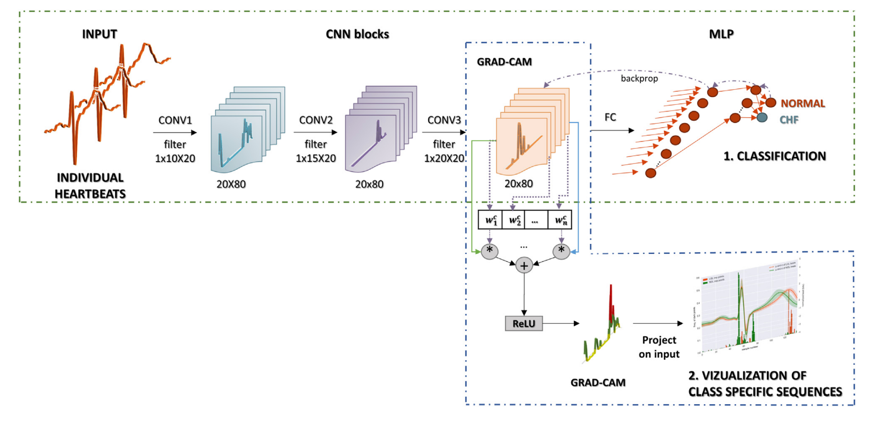

# cnn-for-chf-detection
CNNs for Congestive Heart Failure Detection. Explanaible AI technique called GradCAM is used.

This repo is built to replicate the process mentioned in the research paper "A convolutional 
neural network approach to detect congestive heart failure" by Mihaela Porumb, Ernesto Iadanza, 
Sebastiano Massaro, and Leandro Pecchia.

Link: https://www.sciencedirect.com/science/article/abs/pii/S1746809419301776

