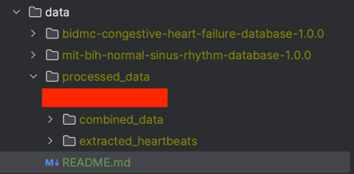

Steps for Reproducibility:

1. Download the datasets from the following links:
   1. MIT BIH: https://physionet.org/content/nsrdb/1.0.0/
   2. BIDMC: https://physionet.org/content/chfdb/1.0.0/
2. Add downloaded files to the following folders created under this directory. i.e. /data/ :
   1. mit-bih-normal-sinus-rhythm-database-1.0.0
   2. bidmc-congestive-heart-failure-database-1.0.0
3. Create an additional folder called "processed_data" to store the results of data processing.
4. Inside "processed_data", create "extracted_heartbeats" and "combined_data" folders.

The completion of these steps means your data folder looks like this:
